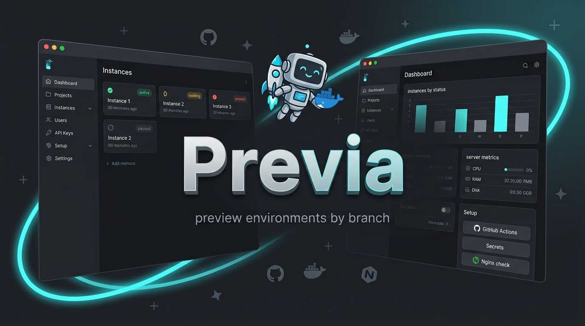

# Previa | Self-hosted preview & ephemeral environments

> **Try the live demo** (no install): [numnes.github.io/previa](https://numnes.github.io/previa/login/?demo=1)  
> Sign in with `admin@demo.local` / `demo` (or `operator@demo.local` / `demo`). UI-only mocked data — details in [docs/demo.md](docs/demo.md).

**Previa** is a self-hosted platform for **preview environments**, **ephemeral environments**, and **review apps** — temporary, isolated deploys you spin up per **branch** or **pull request** on infrastructure you control.

Formerly published as **deployer**; the CLI is now `previa` (the old `deployer` command still works as an alias).

Open a PR, trigger a GitHub Action, and get a live **deploy preview** URL. No Vercel lock-in, no per-seat SaaS. One VPS (or bare metal), nginx, PM2, and a dashboard to manage what is running.

Also useful if you search for: **feature-branch environments**, **dynamic environments**, **on-demand test environments**, **PR preview deployments**, or a lightweight **self-hosted alternative** to hosted preview/review-app services.

Each branch gets its own checkout, PM2 process, and nginx route (`/{project-slug}/{branch-slug}/`). The dashboard shows active, waiting, paused, and failed instances; a global **slot limit** queues excess deploys until a preview is torn down. Teardown on PR close is supported via workflow.

Self-host on a single machine — or aggregate several previa hosts from one dashboard via **cluster** credentials.

> **Coming soon:** **Kubernetes** as a runtime backend for preview instances. **Docker** is already supported per project (`previa project init`); PM2 remains the default on the host.

## Quick start

### Prerequisites

Install these on the machine that will run previa (the `install.sh` script checks **git**, **Node.js**, and **Docker**):

| Dependency                          | Used for                                                                                | Install                                                                                                                 |
| ----------------------------------- | --------------------------------------------------------------------------------------- | ----------------------------------------------------------------------------------------------------------------------- |
| **Git**                             | Clone previa and app repos                                                            | [git-scm.com/downloads](https://git-scm.com/downloads)                                                                  |
| **Node.js** (LTS recommended, v18+) | API build, CLI helpers                                                                  | [nodejs.org/en/download](https://nodejs.org/en/download) · [nvm](https://github.com/nvm-sh/nvm)                         |
| **Docker** + **Compose**            | Postgres, Redis, and web UI containers                                                  | [docs.docker.com/get-docker](https://docs.docker.com/get-docker/)                                                       |
| **PM2**                             | Runs the previa API locally; also runs preview instances on the host (default runner) | [pm2.keymetrics.io — Quick start](https://pm2.keymetrics.io/docs/usage/quick-start/) (`npm install -g pm2`)             |
| **nginx**                           | Reverse proxy for preview URLs (`/{project-slug}/{branch-slug}/`)                       | [nginx.org/en/download](https://nginx.org/en/download.html) · [Ubuntu/Debian](https://nginx.org/en/linux_packages.html) |

If PM2 is not installed globally, `previa setup` falls back to `npx pm2` for the API only. For production preview deploys with the **PM2 runner**, install PM2 on the host.

nginx is required to serve preview URLs to browsers, but not to start the previa stack itself. See [Configure nginx](docs/nginx.md).

### Install and start

Install the CLI (clones to `~/previa`, adds `previa` to `~/.local/bin`):

```bash
curl -fsSL https://raw.githubusercontent.com/numnes/previa/main/scripts/install.sh | bash
```

Make sure `~/.local/bin` is on your `PATH`, then:

```bash
previa setup    # Postgres + Redis + web (Docker) + API (PM2)
previa status   # check services
```

- **Dashboard:** http://localhost:3001 (or the port shown after `previa setup`)
- **API / Swagger:** http://localhost:3000/docs (API port may differ if 3000 is busy)

On first setup you'll be prompted for an admin email and password.

Behind a reverse proxy (one domain / path for UI + API), copy `previa.env.example` → `previa.env`, set the public URLs, then `previa restart`. See [docs/configuration.md](docs/configuration.md#public-urls-previaenv).

```bash
previa down       # stop everything (asks for confirmation)
previa down -y    # skip confirmation
previa help       # all commands
```

## Setup in a project

After the previa stack is running, wire each application repository once.

### 1. Generate workflows and `previa.yaml`

From your **app repo** root:

```bash
previa project init
```

This copies:

- `.github/workflows/deploy-preview.yml` — deploy on PR open/update
- `.github/workflows/teardown-preview.yml` — remove preview on PR close
- `previa.yaml` — build commands and PM2 entrypoint for your stack

The command detects `gitUrl` and `slug` when possible, asks for anything missing, embeds the project slug in the workflow files, and prints a **registration JSON** block:

```json
{
  "slug": "my-app",
  "gitUrl": "https://github.com/org/my-app.git",
  "serverUrl": "https://preview.example.com"
}
```

`serverUrl` is optional in the JSON (omit it if you will set the Public URL later in the dashboard).

Useful options:

```bash
previa project init ../my-app              # target another directory
previa project init --branches main,develop   # PR target branches
previa project init --force                   # overwrite existing files
```

Non-interactive (e.g. scripts or CI — still prompts for Public URL unless `PREVIA_PROJECT_SERVER_URL` is set):

```bash
PREVIA_PROJECT_SLUG=my-app \
PREVIA_PROJECT_GIT_URL=https://github.com/org/my-app.git \
PREVIA_PROJECT_SERVER_URL=https://preview.example.com \
previa project init
```

### 2. Register the project in the dashboard

1. Copy the JSON printed by `previa project init`
2. Open **Projects → Add project → Import registration JSON**
3. Paste the JSON and click **Create from JSON** (or **Apply to form** to review first)
4. Set the **Public URL** if you already know the domain where previews will be served (see [Configure nginx](docs/nginx.md))

### 3. Create an API key

In the dashboard: **Users → API Keys** → create a key and save the value (shown once).

### 4. Configure GitHub secrets

In the **app repo** on GitHub: **Settings → Secrets and variables → Actions**

| Secret             | Value                                                                                    |
| ------------------ | ---------------------------------------------------------------------------------------- |
| `PREVIA_API_URL` | Public URL of your previa API (no trailing slash), e.g. `https://previa.example.com` |
| `PREVIA_API_KEY` | API key from step 3                                                                      |

The project slug is already set in the workflow files — no extra GitHub variable is required.

### 5. Adjust `previa.yaml` and commit

Edit `previa.yaml` for your build (install, build, start command / PM2 target). Then commit and push `.github/workflows/` and `previa.yaml`.

Opening or updating a PR against a configured branch triggers a deploy; closing the PR runs teardown (if you kept the teardown workflow).

More detail: dashboard **Setup → GitHub Actions** and **Setup → Secrets**.

## Documentation

| Topic             | Guide |
| ----------------- | ----- |
| Dashboard         | [docs/dashboard.md](docs/dashboard.md) |
| Instances & lifetime | [docs/instances.md](docs/instances.md) |
| Cluster (multi-machine) | [docs/cluster.md](docs/cluster.md) |
| Configure nginx   | [docs/nginx.md](docs/nginx.md) |
| Architecture      | [docs/architecture.md](docs/architecture.md) |
| Configuration     | [docs/configuration.md](docs/configuration.md) |
| CLI reference     | [docs/cli.md](docs/cli.md) |
| App config        | `examples/previa.yaml` in each project repo |
| API reference     | http://localhost:3000/docs after `previa setup` |

## License

Licensed under the [Apache License, Version 2.0](LICENSE).

Built for teams who want simple, self-hosted preview environments.
